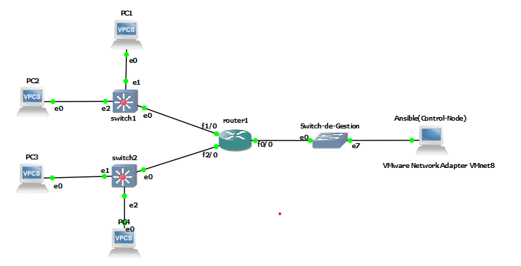
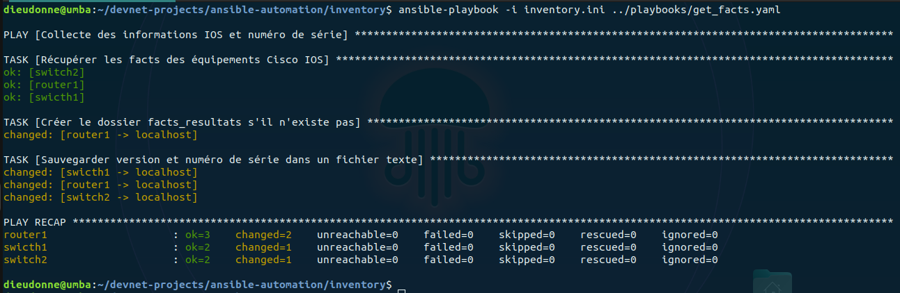
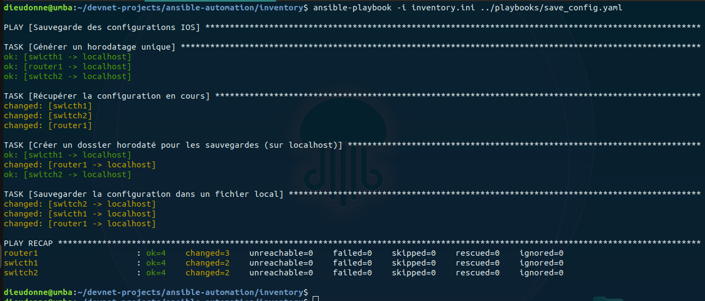
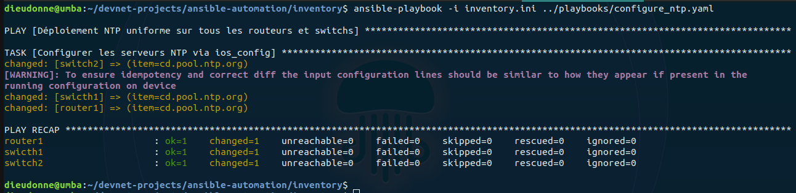
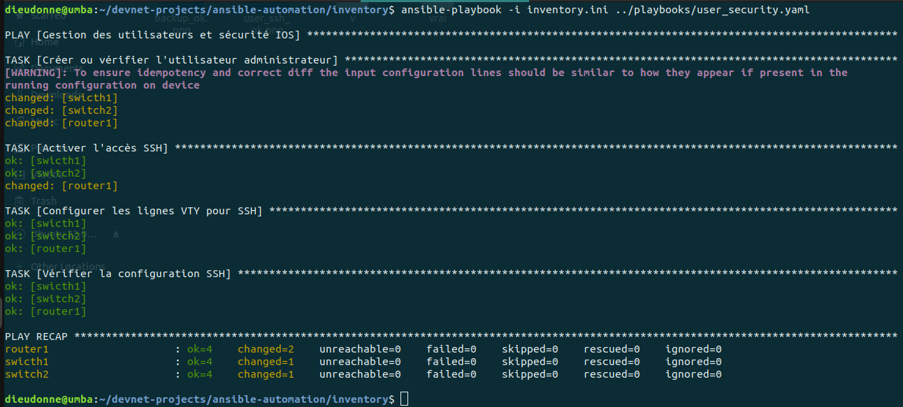
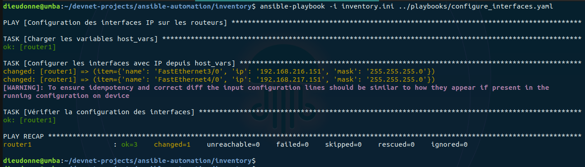
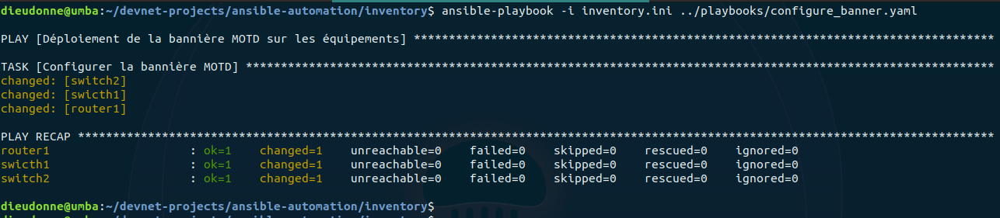
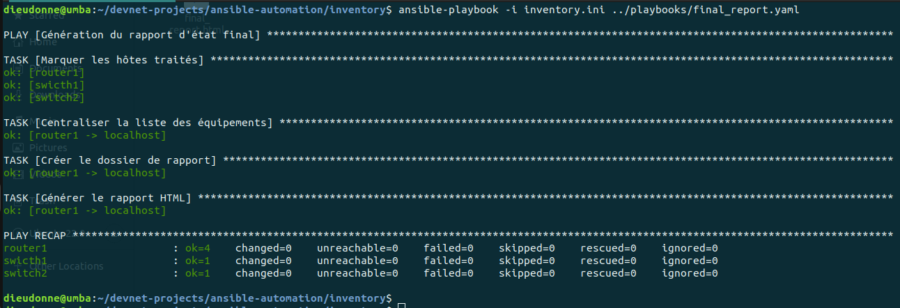

# Projet : Automatisation d’une Infrastructure Réseau Multi-Services avec Ansible

## 👤 Auteurs
* **Travail réalisé par** : Dieudonné UMBA  et Sharon-rose MUKUNDI 
* **Filière** : DevOps et Sécurité informatique
* **Promotion** : Master 2
* **Année académique** : 2025 – 2026  
---
## Objectif du Projet
Ce projet vise à automatiser la configuration et la gestion d’équipements réseau (**routeurs et commutateurs Cisco IOS**) à l’aide d’Ansible afin de :
* **Garantir la cohérence** des configurations.
* **Réduire les erreurs** humaines.
* **Simplifier l’administration**, la sauvegarde et l’audit du réseau.
---
## Environnement de Travail
* **Contrôleur Ansible** : Ubuntu Linux  
* **Outil d’automatisation** : Ansible  
* **Équipements réseau** : Cisco IOS (simulés)  
* **Protocole de gestion** : SSH  
* **Méthode de connexion** : `network_cli`
---
* **Voici la topologie du réseau simulé dans GNS3.**
  
---
## 🗂️ Structure du Projet
```text
ansible-automation/
├── ansible.cfg
├── inventory/
│   └── inventory.ini
├── playbooks/
│   ├── ping.yaml
│   ├── get_facts.yaml
│   ├── save_config.yaml
│   ├── configure_ntp.yaml
│   ├── user_security.yaml
│   ├── deploy_vlans.yaml
│   ├── configure_interfaces.yaml
│   ├── configure_banner.yaml
│   ├── audit_snmp.yaml
│   └── final_report.yaml
├── templates/
│   ├── motd_banner.j2
│   └── report.j2
├── host_vars/
│   └── router1.yaml
├── backups/
├── reports/
│   └── final_report.html
├── screenshots/
├── facts_resultats/
└── README.md
```
---
 ### 1. Inventaire et Connectivité
* **Description** : Un inventaire Ansible a été créé pour regrouper les équipements réseau par groupes (routers et switches) La connectivité SSH est testée sur tous les équipements réseau.
Playbook utilisé : **ping.yaml**
* **Résultat**


----
### 2. Collecte des Informations (Facts)
* **Description** : Ce playbook permet de collecter automatiquement la version du système IOS et le numéro de série des équipements.
Les résultats sont sauvegardés dans le dossier facts_resultats/.
Playbook utilisé : **get_facts.yaml**
* **Résultat**
   
----
### 3. Sauvegarde des Configurations
* **Description** : La configuration courante (running-config) de chaque équipement est sauvegardée
automatiquement dans un seul dossier horodaté sur le contrôleur Ansible.
Playbook utilisé : **save_config.yaml**
* **Résultat**
   
----
### 4️. Configuration du Serveur de Temps (NTP)
* **Description** : Une configuration NTP uniforme est appliquée afin d’assurer une synchronisation correcte
de l’horloge sur tous les équipements réseau.
Playbook utilisé : **configure_ntp.yaml**
* **Résultat**
  
----
### 5. Gestion des Utilisateurs et Sécurité
* **Description** : Ce playbook assure la création d’un utilisateur administrateur sécurisé, l’application d’un mot de passe chiffré ainsi que l’activation de l’accès SSH.
Playbook utilisé : **user_security.yaml**
* **Résultat**
  
----
### 6. Déploiement des VLANs
* **Description** : Les VLANs sont déployés uniquement sur les commutateurs via une boucle Ansible ( VLAN 10 : Data, VLAN 20 : Voice et VLAN 30 : Management)
Playbook utilisé : **deploy_vlans.yaml**
* **Résultat**  
----
### 7. Configuration des Interfaces
* **Description** : Les interfaces réseau sont configurées automatiquement à partir des fichiers
host_vars/ spécifiques à chaque équipement.
Playbook utilisé : **configure_interfaces.yaml**
* **Résultat**
   
----
### 8. Bannière MOTD avec Templates Jinja2
* **Description** : Une bannière MOTD dynamique est déployée via Jinja2, affichant le nom de l’équipement et le message de bienvenue de l'entreprise
Playbook utilisé : **configure_banner.yaml**
* **Résultat**

----
### 9. Audit de Conformité SNMP
* **Description** : Ce playbook vérifie la conformité de la configuration SNMP. En cas de non-conformité, il échoue ou corrige automatiquement.
Playbook utilisé : **audit_snmp.yaml**
* **Résultat**
 
----
### 10. Rapport Final
* **Description** : À la fin de l’exécution, un rapport récapitulatif est généré automatiquement afin de
présenter l’état global de l’automatisation.
Playbook utilisé : **final_report.yaml**
* **Résultat**

----
* **Ce rapport liste les équipements mis à jour avec succès.**

----
## Conclusion
Ce projet démontre l’efficacité d’Ansible dans l’automatisation des infrastructures réseau.
L’utilisation des playbooks, des variables et des templates Jinja2 permet une gestion
centralisée, fiable et reproductible des équipements réseau tout en réduisant
considérablement les erreurs humaines.


